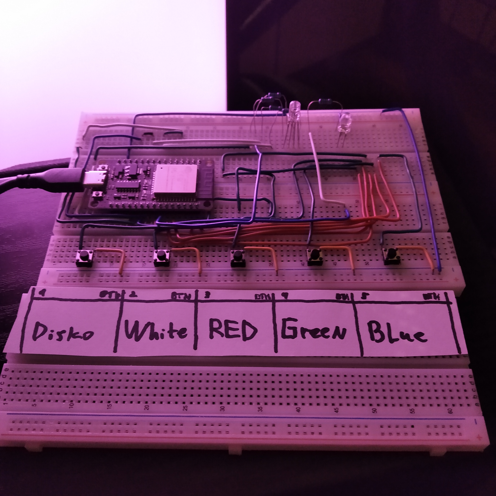
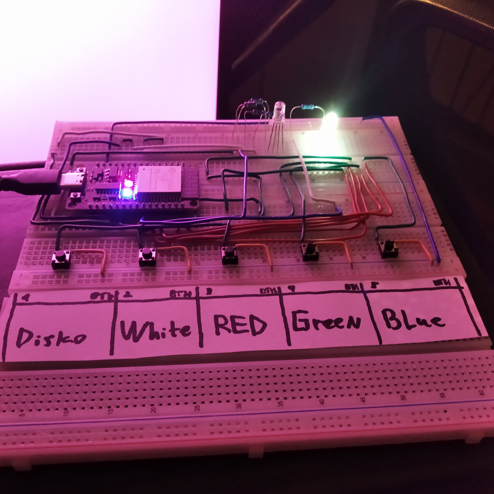
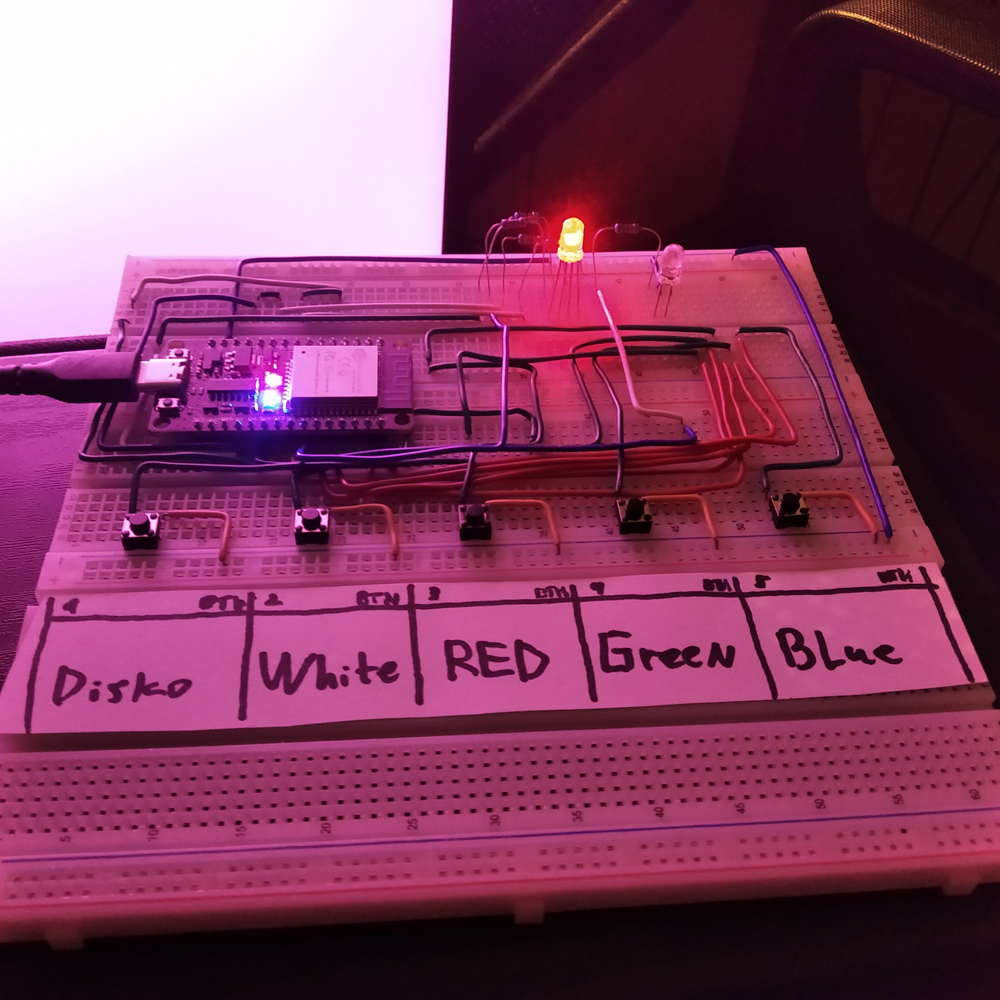
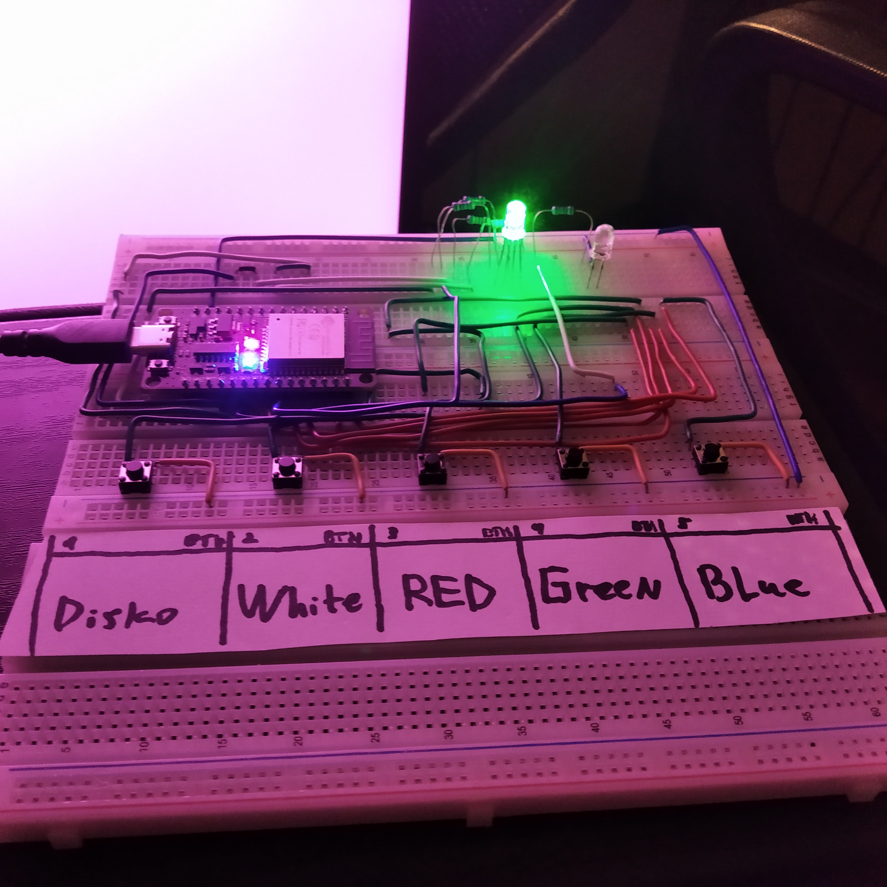
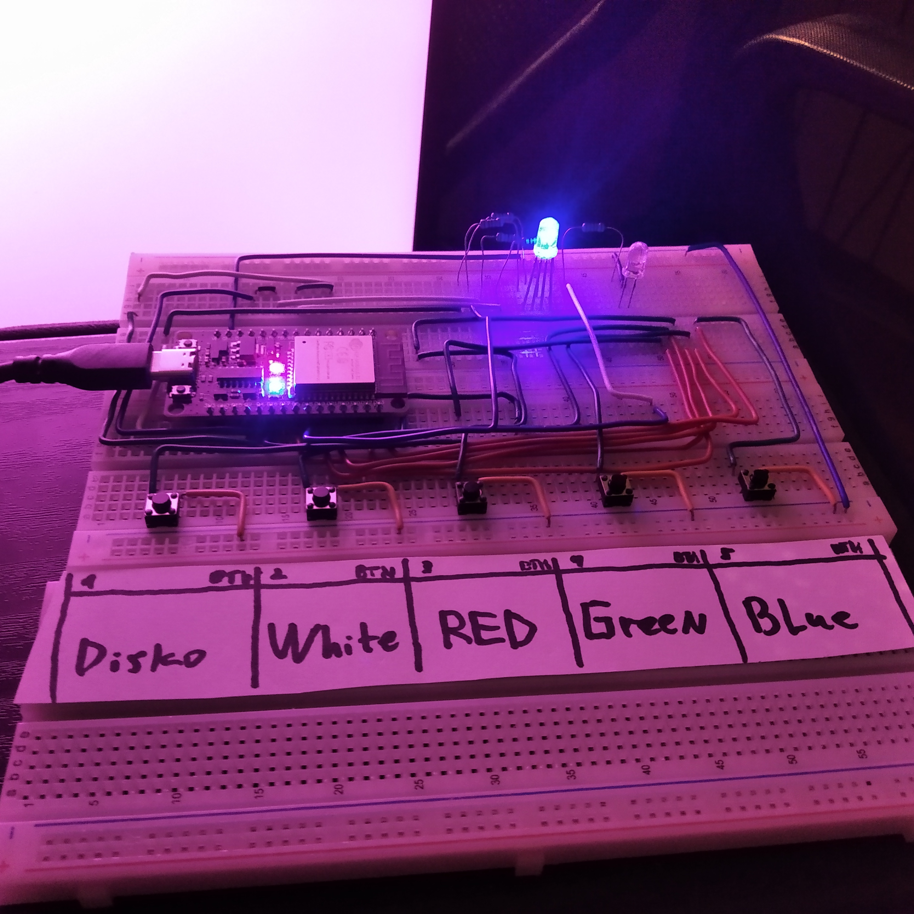
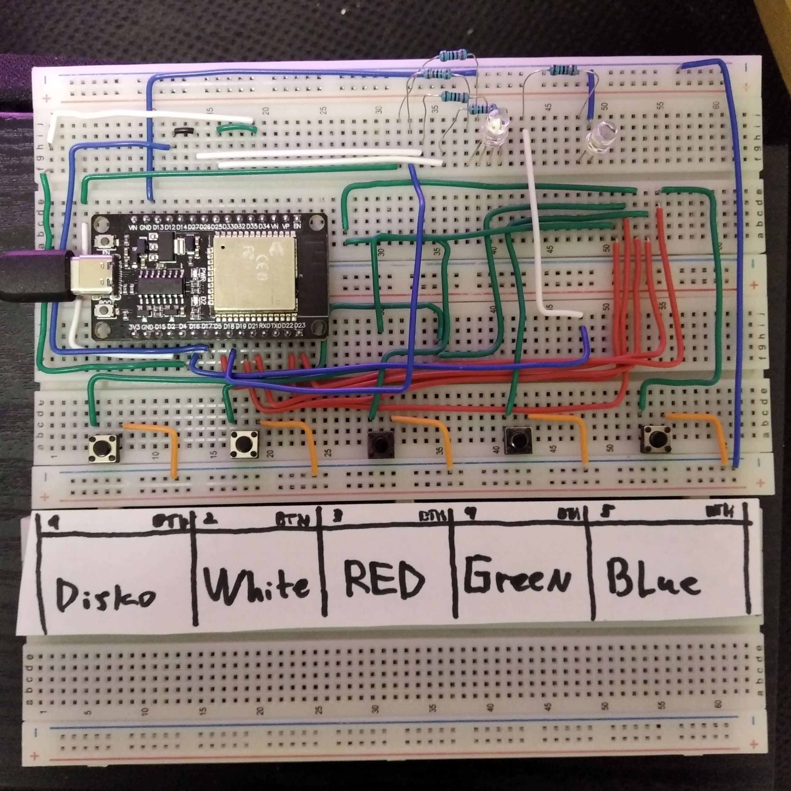

# RGB LED



## 🤨 Навіщо ?:
просто цікавий проект, для навчання основам micropython і роботи із багатокольорними LED.

## 🤓 Опис:
це простий тест на працездатність ESO32 із прошивкою micropython. таккож ідеально для для навчання основам micropython і роботи із багатокольорними LED.

## ☠️ Використані технології:
- прошивка на MICROPYTHON
- складання схеми на макетній платі

## 🌱 Структура проекта:
- `screenshots/` — фотографії проекта
- `main.py` — головний файл прошивки

## 😇 Фічі:
- натислута кнопка "WHITE" - світиться лише окремий білий світлодіод (окремий білий)
- натислута кнопка "RED" - світиться лише окремий червоний світлодіод (один різнокольоровий)
- натислута кнопка "GREEN" - світиться лише окремий зелений світлодіод (один різнокольоровий)
- натислута кнопка "BLUE" - світиться лише окремий синій світлодіод (один різнокольоровий)
- натислута кнопка "DISKO" - світлодіод блимає швидко різними кольорами (один різнокольоровий)

## 🌚 Компоненти які для збірки:
- ESP32-WROOM (1x)
- макетні плати (1х-3х)
- кнопки (5х)
- різнокольоровий світлодіод (1х)
- білий світлодіод (1х)
- резистори 220 ом (5х)
- дроти

## ⚠️ ПОПЕРЕДЖЕННЯ:
- якщо ви захочете назначити свої номери пінів, то ось вам список БЕЗПЕЧНИХ ДЛЯ ВИКОРИСТАННЯ пінів:
- 2, 4, 5, 12, 13, 14, 15, 16, 17, 18, 19, 21, 22, 23, 25, 26, 27, 32, 33
- ці піни універсальні і безпечні для загального користування.


## 😎 Як це запустити ?:
1. встановлюємо необхідні пакети на пк/ноутбук
```bash
sudo apt update
sudo apt install python3
sudo pip3 install adafruit-ampy
```
2. заисуємо прошивку на ESP32
```bash
ampy --port /dev/ttyUSB0 put main.py
```

## ✨ А ось так це все виглядає в реальному житті







